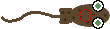

# The amaze-ing race
Imagine a small nasty parasitic creature surviving by feeding on live salmon, eating its skin and causing stress, disease and death.
Sadly, this creature is real.
It's called a sea louse, and it has been terrorizing wild and farmed salmon for decades.
Luckily there is a company out there, Stingray Marine Solutions (that's us), who is solving this problem by making underwater laser robots.

Yup! We're basically making an underwater death star (it's smaller than the original) who's using computer vision to recognize the sea louse and then sapping it in real-time as it swims by.
I guess you could say we would make both Yoda, Luke, Darth Vader and Supreme Leader Snooki proud at the same time.
Not bad!
Just [have a look](https://www.youtube.com/watch?v=Cql2jtjpDzE).

Now we want you to get in on the action as well, but in 2-D.


# Your Task
Your task, if you choose to accept it, is to guide the laser to the pesky louse and fry it!

 

It might sound easy at first, but the lice are clever creatures and protect themselves from the laser by hiding inside mazes with varying characteristics.

In order to fry the louse, you need to navigate the maze and hit the louse, without touching the maze walls.

Your job is to implement a `Player` that will participate in the game. 
The `Player` must implement a `def forward(img, pos)` function.
Where `img` input is a 1024x1024x3 RGB numpy image and position is a numpy 1d numpy array containing the x, y coordinates of the laser-dot.

In order to control the laser the Player outputs the change in position of the laser dot for each frame.
The return value should be on the format `np.array([dx, dy])`.
Where `dx` and `dy` is the change in position of the laser dot limited to `+-5` in each direction.

```python
class Player(object):
    def forward(self, img, pos):
        dx, xy = self.analyze_image(img, pos)
        return numpy.array([dx, dy])
```

Your task is to complete as many levels as possible in this game define `resourc/levels.txt`

# Amaze
Amaze is a game where the player navigates a laser-dot through a maze in order to hit a sea-louse.
If the laser-dot hits the wall the player loses, and if the laser-dot hits the louse the player completes the level.

Amaze is a game written in python and consists of a `Player`, a `Maze` and an `Engine`.
The `Player` receives an image of the scene and possibly the laser-dot coordinate, it outputs an action.
The `Engine` updates the `Player` position and checks for wall collision, louse-hit etc, and updates the status of the game.
An example of how to use `Maze`, `Player` and `Engine` in combination can be found in `amaze/main.py`.
In order to create mazes you can import the maze factory `from amaze.maze import factory as maze_factory`

### Amaze Structure
The different mazes are defined in `amaze.maze`.
And your `Player` should be implemented in the subpackage `amaze.player`.
Here you will find your Player skeleton and an example player (`KeyboardWarrior`).
Feel free to add additional files to the player subpackage (e.g `train_player.py`, `player_utils.py` etc).

# Evaluation
After implementing your player you can evaluate your algorithm by running:

```
python amaze/evaluate.py --levels resource/levels.txt --output path/to/results.json --visualize
```

Your algorithm will be evaluated on how many levels you are able to complete and the total amount of steps used to complete each maze.

After running the evaluation a `result.json` will be created by on the path you specified. 
This file can then be uploaded to the evaluation [server](https://beaj1yz10i.execute-api.eu-west-1.amazonaws.com).
You can use the github user name you registered [with](#how-to-participate)

Although the evaluation server will not run your code directly, the algorithm implementation will be manually evaluated for the top performing participants.

## Prices 
- The first person to complete all levels will receive a [Nvidia Jetson Nano Developer Kit](https://developer.nvidia.com/embedded/jetson-nano-developer-kit)
- We will pick one special main price based on number of levels completed, number of actions and implementation details that will receive a [NVIDIA Jetson Xavier Developer Kit](https://developer.nvidia.com/embedded/jetson-agx-xavier-developer-kit)
- If we like your solution to our challenge we might invite you to come visit us for a tour in our office.


# How to participate
To participate, fill out this [google form](https://docs.google.com/forms/d/e/1FAIpQLScDJE0AUK6yK4WmjU8Panlh2HpplQQhjSjzrv__VQ_EhP2dtw/viewform).
If you wish to keep your github repo private, be sure to add us as collaborators (id: [hakonBG]).
The challenge will last until 15/5 - 2021. 

## Preferred tools
You can use whatever tools you like.
But we've only tested the framework on python 3.7.
If you are to use machine learning tools we would prefer Pytorch, opencv and sklearn. 

## Additional info
We might update this repository during the duration of the challenge to add additional info, fix bugs and make some improvements.
If you fix a bug or have suggestion for improvement, feel free to upload a pull request and we will process it as soon as possible.
You can send questions to challenge@stingray.no or post an issue.

# Links

Follow us on [linkedin](https://www.linkedin.com/company/stingray-marine-solutions-as).

Follow us on [twitter](https://twitter.com/stingraynews).

Checkout our [website](https://www.stingray.no/).

Another cool [video](https://www.youtube.com/watch?v=ITb0bJvS1Dk)

